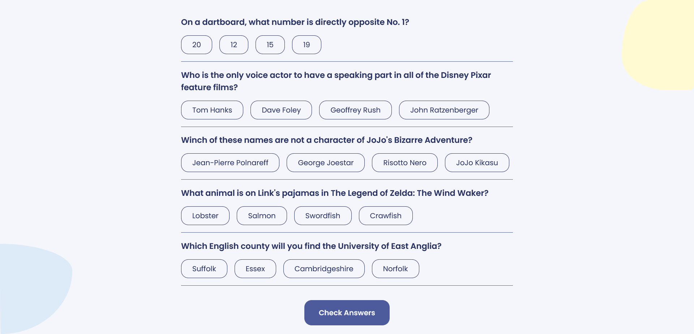
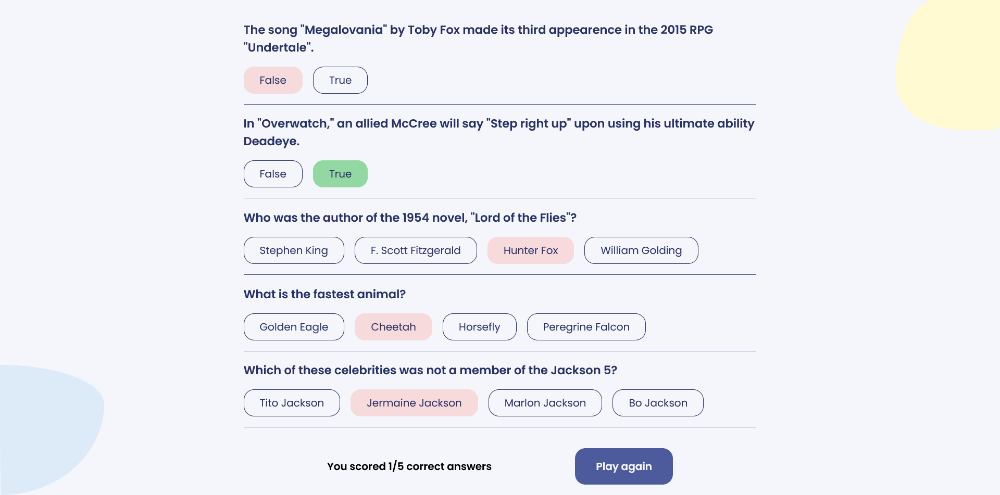

# Quizzical

    

    

<a href="https://quizz-i-cal.netlify.app/">🔗 Live Demo </a>

## 🗒️ About The Project

Quizzical is a Quizz web app, which uses the [The Open Triva DB] to obtain the questions

## 🏗️ Built With

- HTML 5
- CSS
- JavaScript
- React
